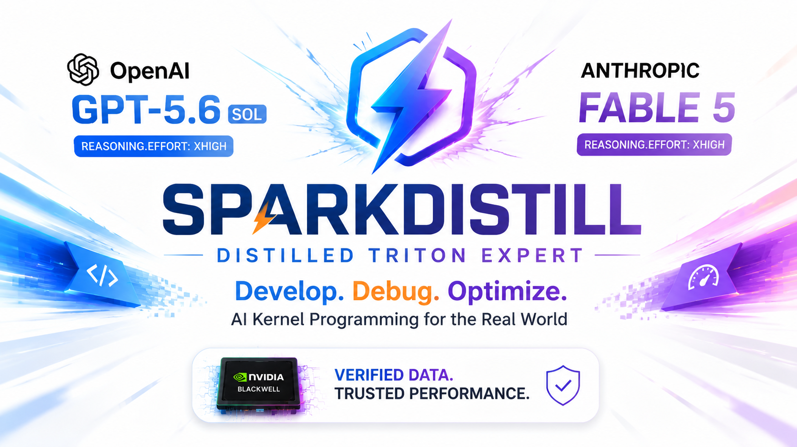

# _SP⚡RKDISTILL_

**Trustless & fast-improving AI models — powered by [SN74 on Gittensor](https://gittensor.io/).**

**SPARKDISTILL** is an open miner economy for **[Triton](https://github.com/triton-lang/triton)-native AI**: frontier teachers
(Claude Fable 5, GPT 5.6) generate data, small students learn to **develop, debug, and
optimize GPU kernels** for the real world, and every reward depends on **cryptographic
verification** — not maintainer opinion or third-party trust.

### What is verified (without trusting miners)

| Track | What you submit | What the validator re-checks |
|---|---|---|
| **Dataset** (`dataset:xs`–`xl`) | Hugging Face `proof/` + registry line | [SparkProof](https://github.com/gittensor-model-hub/SparkProof) bundle: pinned teachers, GPU CC + Intel TDX attestation, release gate, merkle + raw→verified consistency — **no hand-waved CSV** |
| **Training** (`eval:XS`–`XL`) | Public recipe + dataset + eval claim | Retrain-from-source or attested cheap re-score on held-out benchmarks — **not your checkpoint alone** |

Miners compete; the harness and registry gate decide. Third parties do not get veto power
over proofs — only policy, hashes, and measured quality on the frontier.

### What we are building toward

A **latest-[Triton](https://github.com/triton-lang/triton)** specialist stack (Triton 3.7.1 on Blackwell today) that accelerates AI
by making models good at **kernel programming**: translation, correctness, profiling, and
optimization — then serving those students fast on edge hardware via
[`sparkinfer`](https://github.com/gittensor-ai-lab/sparkinfer).

[**SparkProof**](https://github.com/gittensor-model-hub/SparkProof) is what makes miner
datasets valuable: a pre-designed, stratified pipeline whose diversity grows with every
seeded rerun, every row GPU-validated and release-gated, sealed with confidential-computing
attestation, and cheap for anyone to re-verify from the published `proof/` bundle — not a
trust-me CSV.

Production proofs run on **NVIDIA RTX PRO 6000 Blackwell GPUs** using confidential
compute from [Targon](https://targon.com/), **Bittensor Subnet 4 (SN4)** — keeping
SparkProof's attested GPU execution live inside the
[Bittensor ecosystem](https://bittensor.com/).

**Built through SN74 on [Gittensor](https://gittensor.io/).** Contributors submit PRs (datasets, recipes, eval
improvements); a deterministic harness scores marginal quality over the current frontier;
SN74 rewards verified wins. This lives inside the existing SN74 subnet — not a separate
subnet.

## Why SPARKDISTILL

`sparkinfer` makes inference fast; SPARKDISTILL makes the *model* worth serving — and
proves it. The goal is **trustless improvement**: teach a student to reproduce frontier
reasoning and **verified Triton code**, not just plausible text. SPARKDISTILL owns:

- **Trajectory generation.** Prompt a basket of teacher models on reasoning-heavy tasks
  (multi-step math, logic, proof-style code correctness), capturing each teacher's
  chain-of-thought/reasoning trace separately from its final response where the
  provider exposes one (Claude extended thinking).
- **Reasoning-format SFT data.** Fold the captured reasoning into the training target
  as a leading `<think>...</think>` block ahead of the response — matching Qwen3's
  native chat-template format — so the student learns to reason, not just answer.
- **Distillation recipes.** Axolotl-based SFT/LoRA recipes tuned per student model and
  per phase, sized for the hardware SPARKINFER already targets.
- **Quality eval.** A benchmark harness (BFCL, GSM8K, HumanEval, IFEval, MMLU-Pro, plus
  hard-reasoning benchmarks AIME and GPQA-Diamond) that scores a student checkpoint's
  quality relative to its teacher and the current frontier checkpoint.

## Layout & scoring

| Path | What |
|---|---|
| [`teacher/`](teacher) | teacher-trajectory generation — Anthropic (Fable 5) and OpenAI (GPT 5.6) only |
| [`recipes/`](recipes) | Axolotl training recipes per student model / phase |
| [`eval/`](eval) | quality benchmark harness + student-vs-frontier scoring + cheap proof verification (harness/scoring scripts are maintainer-owned) |
| [`proof/`](proof) | proof-of-training bundle packaging + Hugging Face publishing |
| [`runs/`](runs) | immutable ledger of merged, verified runs |

**Scoring is quality-only.** SN74 pays each merged PR for its verified marginal quality
improvement over the current best ("frontier") checkpoint, labeled **XL / L / M / S / XS**
by the deterministic eval loop, the same tiering shape `sparkinfer` uses for speedups.
Tooling, bench, docs, and refactors are welcome but score 0 unless they produce a verified
frontier improvement. See [`.gittensor/weights.json`](.gittensor/weights.json) and
[`docs/miner-guide.md`](docs/miner-guide.md).

## How a PR gets merged & rewarded

**No trained weights are ever the merged artifact.** A submission is a **recipe + the
dataset it was trained on** — both fully reproducible from source — plus the eval numbers
that resulted from running them:

1. A miner picks (or generates) a dataset — teacher trajectories from `teacher/generate.py`,
   optionally reformatted for reasoning via `teacher/format.py` — and a training recipe
   (an Axolotl `sft.yaml` under `recipes/`).
2. They train and score locally against the current frontier (`scripts/eval.sh`).
3. If it beats the frontier, they open a PR containing **the recipe file and the dataset
   (or a public link to it)** — this is the actual submission — plus their local eval
   numbers.
4. The evaluator retrains from that exact recipe + dataset on its own hardware and
   re-scores against the frontier. That retrain is the source of truth; nothing about the
   PR is trusted on the miner's word.
5. If it clears the quality gate, it's merged and labeled **XL / L / M / S / XS** by the
   measured delta, and the new checkpoint becomes the frontier.

The proof-of-training fast path (below) never uploads or trusts a checkpoint at all —
**trained weights never leave the miner's machine**. A proof bundle carries only the
claim: eval scores, training claims, and a per-file sha256 manifest of the checkpoint,
with the whole claim cryptographically bound to the miner's GPU CC attestation
(`claim_sha256` as the NRAS nonce). The validator reproduces the checkpoint locally from
the recipe + dataset — retraining fits the 5-hour budget by rule, so that's cheaper than
downloading multi-GB weights — and cheaply re-scores the claimed numbers instead of a
blind full retrain. The recipe and dataset are what get merged, audited, and reused.

**Why share the recipe and dataset instead of just the weights:** whoever holds the
frontier ("the king") is required to have a fully public recipe + dataset behind their
merged checkpoint — there is no way to merge a PR without them. That means every other
miner can immediately fork the current best recipe/dataset and try to beat it, instead of
one miner permanently sitting on a secret checkpoint nobody else can build on. Verified
improvement is what gets rewarded, so "copy the leader and add one optimization" is a
completely valid — and expected — way to compete.

**Sharing training data:** `data/processed/` stays git-ignored (too large for git). For Triton
datasets, use the **dataset track** — SparkProof on a Blackwell or Hopper H100/H200 CC VM,
then `sparkproof-publish-dataset`, then a text-only registry PR against
[`datasets/registry.jsonl`](datasets/registry.jsonl). GitHub Actions verifies the Hugging
Face `proof/` bundle, **aggregates all merged datasets into the canonical mining dataset**
([`gittensor-model-hub/sparkproof-mining`](https://huggingface.co/datasets/gittensor-model-hub/sparkproof-mining)),
labels `dataset:xs`–`xl`, and merges only if aggregation + publish succeed (≥25 verified rows).
Build the registry line with `scripts/registry_line.sh` (see [`datasets/README.md`](datasets/README.md)).
Training miners point recipes at the mining dataset HF URL or cite it via
`proof.bundle --dataset-url`. The training gate accepts bundles pinned to any canonical
`sft_sha256` from the PR merge-base through HEAD ([#121](https://github.com/gittensor-model-hub/SparkDistill/pull/121)),
so dataset merges mid-train do not waste GPU.

## Canonical mining dataset

Every successful dataset registry merge updates one Hugging Face repo (default:
[`gittensor-model-hub/sparkproof-mining`](https://huggingface.co/datasets/gittensor-model-hub/sparkproof-mining))
with the deduplicated union of all merged registry entries plus `mix_manifest.json`
provenance. CI runs this **before** the PR merges — a publish failure blocks merge.

Local re-mix (optional):

```bash
scripts/mix_registry.sh mix --registry datasets/registry.jsonl --all \
  --out data/processed/mix_sft.jsonl \
  --manifest-out data/processed/mix_manifest.json \
  --sparkproof-root ../SparkProof
```

## Quickstart

```bash
# 1. install
uv sync

# 2. generate teacher trajectories (needs teacher API keys, see .env.example)
scripts/generate_trajectories.sh --prompts data/prompts/phase1.jsonl --out data/processed/phase1_trajectories.jsonl

# 3. fold captured reasoning into <think>-tagged SFT records (messages format)
scripts/prepare_sft_data.sh --in data/processed/phase1_trajectories.jsonl --out data/processed/phase1_sft.jsonl --format messages

# 4. train on canonical mining data (or phase1_sft.jsonl with sft.yaml)
scripts/install_train.sh
scripts/prepare_mining_sft.sh
scripts/train.sh recipes/qwen3.5-4b-phase1/sft-mining.yaml

# 5. score the resulting checkpoint against the frontier
scripts/eval.sh --checkpoint outputs/qwen3.5-4b-phase1 --compare-frontier
```

## Proof of training

A submission's **eval claim** can skip full retrain-verification if the miner proves it
instead of just asserting it. This is a verification shortcut for the eval *numbers* — it
does not replace sharing the recipe + dataset above, which is required on every PR
regardless of whether this fast path is used:

1. Fine-tune locally and score against the current frontier (`scripts/eval.sh`).
2. If you beat the frontier, package the **claim** into a bundle — eval scores,
   training claims, and a per-file sha256 manifest of your checkpoint, **not the
   weights** (`python -m proof.bundle`) — and note the printed `claim_sha256`.
3. Attest the GPU you trained/evaluated on — e.g. a Blackwell RTX PRO 6000 Server
   Edition confidential-computing (CC) node — passing the claim digest as the
   attestation nonce so the NRAS-signed token commits your exact claim to your GPU
   (`python -m eval.attestation --nonce <claim_sha256>`).
4. Publish the small, weights-free bundle to Hugging Face (`python -m proof.publish`)
   — the resulting HF URL is your proof link.
5. Open a PR referencing the HF proof link and your attestation, **and** the
   recipe + dataset link as described above.
6. The validator reproduces your checkpoint locally from the recipe + dataset, then
   cheaply re-verifies — a small held-out re-run of your claimed scores plus
   attestation validation (including the `claim_bound` nonce check), **not** a blind
   full retrain — and merges if it checks out (`python -m eval.verify --checkpoint <local>`).
7. The merge is appended to the immutable `runs/ledger.jsonl` log, and the new
   checkpoint becomes the frontier for the next submission.

Unattested submissions still go through the slower path: full retrain-from-source
verification, same as before this feature existed. See
[`docs/miner-guide.md`](docs/miner-guide.md) for the exact commands and
[`runs/README.md`](runs/README.md) for the ledger format.

## Verifying dataset proofs (no CC VM required)

The **dataset track** rewards verified SparkProof training data merged via
[`datasets/registry.jsonl`](datasets/registry.jsonl). Miners **prove** datasets on a
Blackwell or Hopper H100/H200 CC VM with [SparkProof](https://github.com/gittensor-model-hub/SparkProof)
(the manifest records which); validators **verify** from the Hugging Face `proof/`
directory on any CPU host — GitHub Actions, a laptop, no NVIDIA GPU.

```bash
# Validator / local re-check (downloads proof/ from HF)
python -m eval.dataset_verify \
  --hf-repo <user>/<repo> \
  --claimed-sha256 <trajectories_sha256 from the PR> \
  --sparkproof-root ../SparkProof \
  --out eval/results/dataset_report.json

# Under the hood this re-runs production sparkproof-verify (offline by default)
uv run sparkproof-verify --bundle /path/to/proof
uv run sparkproof-verify --bundle /path/to/proof --online   # + NVIDIA NRAS JWKS signature
```

Registry PRs are gated automatically by
[`.github/workflows/dataset_registry.yml`](.github/workflows/dataset_registry.yml) — see
[`datasets/README.md`](datasets/README.md) for the miner flow and label thresholds
(`dataset:xs/s/m/l/xl` merge, `dataset:none` below threshold, `dataset:REJECT` closed).

### What offline verification enforces

For each trajectory row, production verification checks the **stored bundle** — not live
hardware or live teacher API calls:

| Check | What it proves |
|---|---|
| `provider` + `model` | Only `claude-fable-5` (Anthropic) and `gpt-5.6` / `gpt-5.6-sol` (OpenAI) |
| `gateway` + `gateway_model` | Call went through **OpenRouter** or **yunwu** with pinned slugs |
| `request_sha256` | The committed request body matches the pinned call: model slug + `reasoning.effort=xhigh` + prompt/settings |
| `metadata.gateway_response_model` (yunwu) | Response model slug is also pinned |
| raw → verified consistency | Miner cannot swap `trajectories.jsonl` after GPU attestation / release gate |
| `gpu_attestation` nonce | Attestation is bound to `trajectories_raw.jsonl`, not a different dataset |
| `gpu_attestation.tdx` | Intel TDX quote `report_data` bound to the same dataset nonce (required on new bundles) |
| release gate + PR hash | `trajectories_sha256` in the PR still matches the gated HF artifact |

**Offline verify means:** the miner recorded the exact pinned teacher slugs
(`claude-fable-5` + `gpt-5.6-sol`) via an approved gateway at `xhigh` reasoning, and did
not tamper with the bundle after proving. It is **not** a live cryptographic proof that
OpenAI/Anthropic actually served those models on every call.

### Offline vs online

| Mode | Teacher model guarantee | GPU guarantee |
|---|---|---|
| **Offline** (registry CI today) | Bundle claims + `request_sha256` + gateway slug metadata + tamper checks | Stored `gpu_attestation.json` fields + nonce binding + TDX `report_data` binding |
| **Online (`--online`)** | Same as offline | Above **plus** NVIDIA NRAS JWT signature and Intel DCAP TDX quote verification |
| **Online + OpenRouter ledger** | Can re-query OpenRouter generation IDs — only for `gateway=openrouter` and only with the creating API key | Same as online |

For **yunwu** bundles there is currently no external teacher ledger re-check. Swapping rows
to another model (e.g. `gpt-4o-mini`) is caught by policy + raw/verified consistency.
Full detail: [SparkProof README — Verifying proofs](https://github.com/gittensor-model-hub/SparkProof#verifying-proofs-no-cc-vm-required).

## Miner guide

If you are contributing for SN74 rewards, start with
[`docs/miner-guide.md`](docs/miner-guide.md). It explains what scores, what gets
rejected, and the local commands to run before opening a PR.

## Roadmap

**Phase 1 — Qwen3.5-4B proof of concept.** Prove the trajectory-generation → Axolotl SFT →
eval-harness loop end to end on a dense student model that's cheap to iterate on and fits
comfortably on the hardware `sparkinfer` already targets (RTX PRO 6000 Blackwell class).
Includes the full dataset track: SparkProof prove → registry PR → **auto-aggregate into
[`gittensor-model-hub/sparkproof-mining`](https://huggingface.co/datasets/gittensor-model-hub/sparkproof-mining)
before merge** → train the Phase 1 student on that canonical mix.

**Phase 2 — Qwen3.6-35B-A3B.** Extend the pipeline to the MoE student model that matches
`sparkinfer`'s own MoE decode focus (Qwen3-MoE family), once Phase 1's loop is proven and
the eval basket is stable.

**Phase 3 — Continuous distillation.** Feed verified frontier checkpoints back into
`sparkinfer`'s benchmark and eval-trust pipeline automatically, closing the loop between
model quality improvements here and serving-speed improvements there.

## Dataset warning (read before you submit)

**Dataset-track miners must follow the terms of service of every teacher gateway and
upstream model provider used to build their data** (OpenRouter, yunwu, Anthropic, OpenAI,
etc.). Submitting a verified bundle or opening a registry PR does not mean maintainers
have reviewed, approved, or warranted your legal right to collect, train on, or
redistribute that dataset.

**SparkDistill maintainers accept no responsibility** for miner compliance, copyright or
licensing claims, regulatory exposure, or how third parties use published trajectories.
Technical verification (`dataset:*` labels, GPU attestation, SparkProof policy) proves
bundle integrity — not that your use of teacher APIs was permitted. See
[SparkProof `CONTRIBUTING.md`](https://github.com/gittensor-model-hub/SparkProof/blob/main/CONTRIBUTING.md)
for the full terms-of-service gate.

built with ❤️

## License

MIT, see [`LICENSE`](LICENSE).
